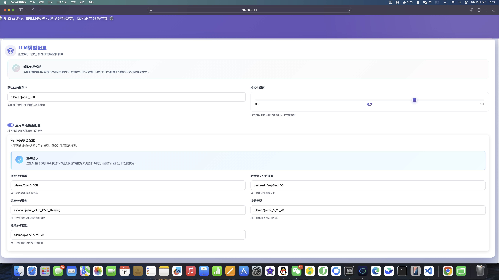

# HomeSystem

基于 Docker 的模块化智能家庭自动化系统，集成本地和云端大模型，提供文档管理、论文收集和工作流自动化功能。

交流群：963812265（qq）

https://www.zhihu.com/column/c_1935713729351221271 该链接的论文由该智能体生成，几乎没有任何修改。

## ✨ 核心功能

- 🐳 **模块化部署**: 三大独立模块，支持分布式跨机器部署
- 📚 **智能论文分析**: 基于ArXiv的自动论文收集、分析和管理
- 🔍 **高级OCR处理**: 远程GPU加速的PaddleOCR文档识别服务
- 🌐 **多LLM支持**: DeepSeek V3、Qwen、Doubao等多种大模型
- 📊 **可视化分析**: 论文数据的智能统计和趋势分析
- 🔄 **工作流自动化**: 定时任务调度和批处理功能

## 🏗️ 系统架构

HomeSystem 采用模块化设计，由三个独立的 Docker 服务组成，可在不同机器上部署：

```
┌─────────────────────┐    ┌─────────────────────┐    ┌─────────────────────┐
│     数据库服务        │    │    远程OCR服务       │    │   PaperAnalysis    │
│  (Database Module)  │    │ (Remote OCR Module) │    │   (Web Module)     │
├─────────────────────┤    ├─────────────────────┤    ├─────────────────────┤
│ • PostgreSQL:15432  │    │ • OCR Service:5001  │    │ • Web App:5002     │
│ • Redis:16379       │◄───┼─• GPU加速处理        │◄───┼─• 论文管理界面      │
│ • pgAdmin:8080      │    │ • PaddleOCR引擎     │    │ • API接口          │
│ • Redis Web:8081    │    │ • 批量文档处理       │    │ • 任务调度          │
└─────────────────────┘    └─────────────────────┘    └─────────────────────┘
        │                           │                           │
        └───────────────────────────┼───────────────────────────┘
                                   │
                            网络连接支持
                          跨主机LAN部署
```

## 🔌 默认端口配置

| 服务 | 主机端口 | 说明 |
|------|---------|------|
| PostgreSQL | 15432 | 主数据库 |
| Redis | 16379 | 缓存数据库 |
| pgAdmin | 8080 | 数据库管理界面 (可选) |
| Redis Commander | 8081 | Redis管理界面 (可选) |
| OCR Service | 5001 | OCR处理API |
| PaperAnalysis | 5002 | Web应用程序 |

## 🚀 快速部署

### 🌟 推荐：云端镜像部署（无需克隆代码）

使用预构建的Docker镜像，最简单快捷的部署方式。

#### 前置要求

- Docker 20.10+ 和 Docker Compose 2.0+
- **必须配置Ollama本地模型服务**：
  - 在一台机器上配置好ollama，实现局域网内的访问
  - ollama要拉取以下模型：
    ```
    qwen3:30b 
    qwen2.5vl:7b
    ```
    VL模型为必须，如果配置不够可以拉取qwen2.5vl:3b，包括qwen3:4b

#### 一体化部署（推荐新用户）

```bash
# 1. 创建项目目录
mkdir homesystem && cd homesystem

# 2. 创建配置文件
curl -o docker-compose.yml https://raw.githubusercontent.com/yangtao121/homesystem/main/deploy/docker-compose.yml

# 3. 修改关键配置
vim docker-compose.yml
# 必须修改：
# - POSTGRES_PASSWORD: 设置安全的数据库密码
# - DEEPSEEK_API_KEY: 填写您的 DeepSeek API 密钥
# - OLLAMA_BASE_URL: 修改为您的Ollama服务地址 (如: http://192.168.1.100:11434)

# 4. 启动所有服务
docker compose up -d

# 5. 访问应用
# Web界面: http://localhost:5002
# 数据库: localhost:15432
# OCR API: http://localhost:5001
```

#### 分离部署（高级用户）

适合多机器部署，支持GPU加速OCR，详见：[deploy/README.md](deploy/README.md)

| 部署方式 | 适用场景 | 优势 |
|---------|---------|------|
| 云端镜像-一体化 | 快速体验、小规模使用 | 🚀 最简单，一键部署 |
| 云端镜像-分离式 | 生产环境、资源优化 | 🏗️ 灵活分布，性能最佳 |
| 源码部署 | 开发调试、自定义修改 | 🔧 完全可控，支持定制 |

---

### 源码部署

#### 前置要求

- Docker 20.10+ 和 Docker Compose 2.0+
- 检查端口是否可用：
  ```bash
  ./check-ports.sh  # 检查核心端口
  ```

- 在一台机器上配置好ollama，实现局域网内的访问。
- ollama要拉取以下模型：

  ```
  qwen3:30b 
  qwen2.5vl:7b
  ```
  VL模型为必须，如果配置不够可以拉取qwen2.5vl:3b，包括qwen3:4b。

#### 第一步：全局配置

**⚠️ 重要：所有模块部署前必须先配置根目录的 `.env` 文件**

```bash
# 在项目根目录创建全局配置文件
cd /path/to/homesystem
cp .env.example .env
vim .env
```

**最小必需配置：**
```env
# 数据库配置
DB_HOST=localhost          # 跨主机部署时修改为数据库主机IP
DB_PORT=15432
DB_NAME=homesystem
DB_USER=homesystem
DB_PASSWORD=your_secure_db_password_here

# Redis配置
REDIS_HOST=localhost       # 跨主机部署时修改为Redis主机IP
REDIS_PORT=16379

# LLM API配置（至少配置一个）
DEEPSEEK_API_KEY=sk-your_deepseek_api_key_here
DEEPSEEK_BASE_URL=https://api.deepseek.com

# OCR服务配置
REMOTE_OCR_ENDPOINT=http://localhost:5001  # 跨主机部署时修改为OCR主机IP
```

#### 第二步：部署数据库服务

```bash
cd database/

# 启动数据库服务
./start.sh

# 验证服务运行状态
docker compose ps
./check-tables.sh
```

**访问地址：**
- PostgreSQL: `localhost:15432`
- Redis: `localhost:16379`
- pgAdmin (可选): `http://localhost:8080` (admin@homesystem.local / admin123)

#### 第三步：部署OCR服务

```bash
cd remote_app/

# 构建并启动OCR服务
./deploy.sh --build

# 检查GPU支持（如果有GPU）
docker compose logs ocr-service
```

**访问地址：**
- OCR API: `http://localhost:5001`
- 健康检查: `http://localhost:5001/api/health`

#### 第四步：部署Web应用

```bash
cd Web/PaperAnalysis/

# 确保全局配置文件存在
ls -la ../../.env

# 部署Web服务
./deploy.sh --build

# 检查服务状态
docker compose ps
```

**访问地址：**
- Web界面: `http://localhost:5002`
- API接口: `http://localhost:5002/api/`

## 🌐 跨主机部署

### 网络拓扑

```
主机A (数据库)          主机B (OCR)           主机C (Web)
┌─────────────────┐    ┌─────────────────┐    ┌─────────────────┐
│ PostgreSQL:15432│◄───┼─OCR Service:5001│◄───┼─PaperAnalysis   │
│ Redis:16379     │    │                 │    │ :5002           │
└─────────────────┘    └─────────────────┘    └─────────────────┘
   192.168.1.100        192.168.1.101         192.168.1.102
```

### 配置示例

**主机A (数据库)：**
```bash
cd database/
./start.sh
```

**主机B (OCR)：**
```bash
cd remote_app/
./deploy.sh --build
```

**主机C (Web)：**
```bash
# 修改根目录配置指向远程服务
cd /path/to/homesystem
cat > .env << EOF
DB_HOST=192.168.1.100
DB_PORT=15432
REDIS_HOST=192.168.1.100
REDIS_PORT=16379
REMOTE_OCR_ENDPOINT=http://192.168.1.101:5001
DEEPSEEK_API_KEY=your_api_key_here
EOF

cd Web/PaperAnalysis/
./deploy.sh --build
```

## 🔧 自定义端口配置

如果默认端口被占用，可通过环境变量修改：

```bash
# 数据库模块
cd database/
cat > .env << EOF
DB_PORT=25432
REDIS_PORT=26379
EOF

# OCR模块
cd remote_app/
cat > .env << EOF
OCR_SERVICE_PORT=8080
EOF

# Web模块
cd Web/PaperAnalysis/
cat > .env << EOF
FLASK_PORT=8002
EOF
```


## 功能介绍

### PaperAnalysis


<div style="text-align: center;"></div>


PaperAnalysis能够根据用户指令，自动持续跟踪相关文献，并提取关键信息，生成摘要和分析报告。
只需要提供相关论文的中文描述，就能自动生成搜索关键词，和对应的要求。
增强的Arxiv搜索，能一次性搜索高达3w篇论文进行分析。
同时也支持通过上传PDF进行论文深度总结。当前具有的功能如下：

 - 领域最新论文持续跟踪（定时搜索任务）。
 - 支持自动按类别创建dify知识库（需额外部署dify，以及embedding模型）。
 - 自动论文搜索功能。
 - 支持分析侧重点（你最想关注的地方）。

推荐模型设置如下：

<div style="text-align: center;"></div>


## 📄 许可证

本项目采用 **CC BY-NC-SA 4.0** 许可证，禁止免费商业使用。

- ✅ **个人使用**: 允许个人学习、研究和非商业用途
- ✅ **学术使用**: 支持教育机构和研究目的使用
- ❌ **商业使用**: 禁止直接商业化或商业分发
- 📧 **商业许可**: 如需商业使用，请联系项目维护者获取商业许可

详见 [LICENSE](LICENSE) 文件。

## 🔗 相关文档

- **常见问题解决**: [FAQ.md](FAQ.md) - 端口冲突、连接失败、服务验证等问题解决方案
- **数据库部署**: `database/README.md` - 完整的数据库部署指南
- **OCR服务**: `remote_app/README.md` - OCR服务配置和使用
- **Web应用**: `Web/PaperAnalysis/README.md` - PaperAnalysis详细功能
- **开发指南**: `docs/` - 各组件开发文档


